**Course:** MOD10 Machine Learning — Winter 2026 — Concordia
**Instructor:** Mohammed A. Shehab
**Group:** 07
**Project:** Cybersecurity Intrusion Detection — ML + DL + Docker deployment

---

## Introduction

### Problem statement

We built a binary classifier that flags network sessions as **Attack** or **Normal** from nine raw features describing traffic and user behaviour. Our team of four was asked to design the full pipeline end-to-end: exploratory analysis, feature engineering, classical and deep-learning models, interpretability, and a deployable service. We chose **Random Forest as our deployed champion** (F1 = 0.855 on a held-out test set of 1908 sessions), served through a FastAPI + Gradio stack and packaged in a single Docker Compose setup.

### Approach at a glance

Rather than chasing the highest single metric, we organised the project as a chain of explicit decisions, each motivated by the data we saw at the previous step:

1. **EDA first** — we let the data tell us which features were worth engineering and which could be dropped. Two findings drove every downstream decision: `failed_logins` is the strongest univariate predictor (Pearson 0.36), and `browser_type = Unknown` carries a 73% attack rate versus a 43% baseline.
2. **Baselines before deep learning** — we started with a `DummyClassifier` as a sanity floor (F1 = 0), then Logistic Regression, Random Forest, and XGBoost. Only then did we train four variants of a Dense Neural Network.
3. **Honest comparison** — when our DNN did not beat the tree-based models, we reported it as such. On a 7 629-sample tabular problem, gradient-boosted and bagged trees are expected to dominate Deep Learning ([Grinsztajn et al. 2022](https://arxiv.org/abs/2207.08815)), and our numbers reproduced that finding.
4. **Interpretability in production** — SHAP is not an after-thought notebook; it runs *live* in the deployed UI on every prediction.
5. **Deployment that actually launches** — `docker compose up -d` is the one command required, and it starts a single service that serves both the REST API and the Gradio UI on port 8000.

### Stack

Imposed by scope and by our team's prior experience:

- **Python 3.10+**, `pandas`, `numpy`, `scikit-learn` (pinned to 1.7.2 for cross-version reproducibility)
- **TensorFlow / Keras** for the DNN
- **XGBoost** for gradient boosting
- **SHAP** (TreeExplainer) for global and local explanations
- **FastAPI + Uvicorn** for the REST service
- **Gradio** mounted on the FastAPI app at `/ui` for the interactive UI
- **Docker + Docker Compose** for packaging
- **MLflow** file-backed store for experiment tracking (10 runs across notebooks 02, 03 and 05)

---

## Data Preprocessing and Exploratory Data Analysis

### Dataset overview

The Kaggle *Cybersecurity Intrusion Detection* dataset gave us **9 537 network sessions** with 11 columns. After dropping `session_id` and the `attack_detected` target, we worked with 9 predictor features: five numerical (`network_packet_size`, `login_attempts`, `session_duration`, `ip_reputation_score`, `failed_logins`), three categorical (`protocol_type`, `encryption_used`, `browser_type`) and one binary (`unusual_time_access`).

Key data-quality observations:

- **No duplicates.**
- **One column with missing values:** `encryption_used` has 1 966 NaN (20.6%). We kept the NaN as an explicit `Unknown` category rather than imputing, so the model could learn from the pattern of missingness itself.
- **No outliers to drop** — the numerical features have well-behaved ranges on inspection.

### Class balance — Figure 1

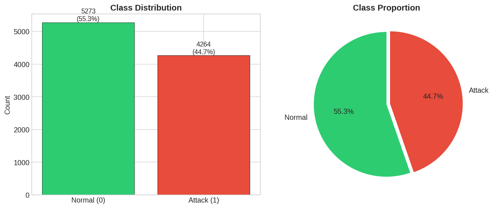

The two classes sit at **Normal 5 273 (55.3%)** vs **Attack 4 264 (44.7%)**, a ratio of 1.24:1. Real intrusion data in production would be closer to 99:1, but this "balanced for teaching" distribution has one concrete consequence for us: we did **not** apply SMOTE, because the class imbalance was not pathological and the synthetic samples would only add noise. Instead we set `class_weight="balanced"` on Logistic Regression and Random Forest, and `scale_pos_weight = 1.24` on XGBoost. The DNN was trained without re-weighting and its probability outputs were calibrated enough without any correction.

### Numerical features per class — Figures 2 and 3

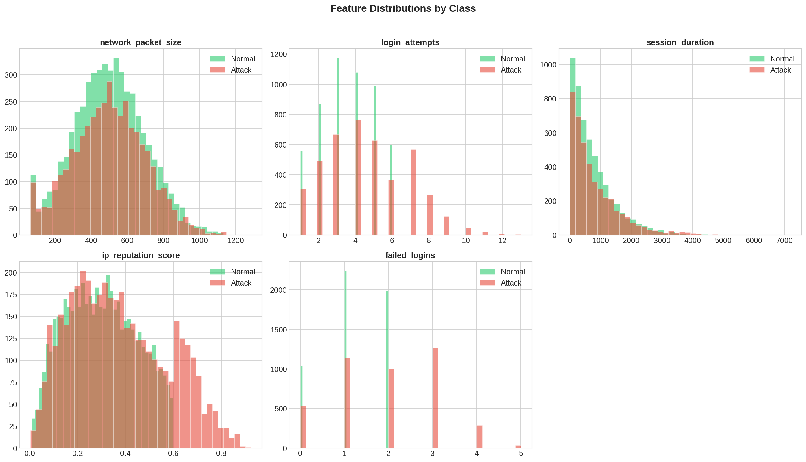

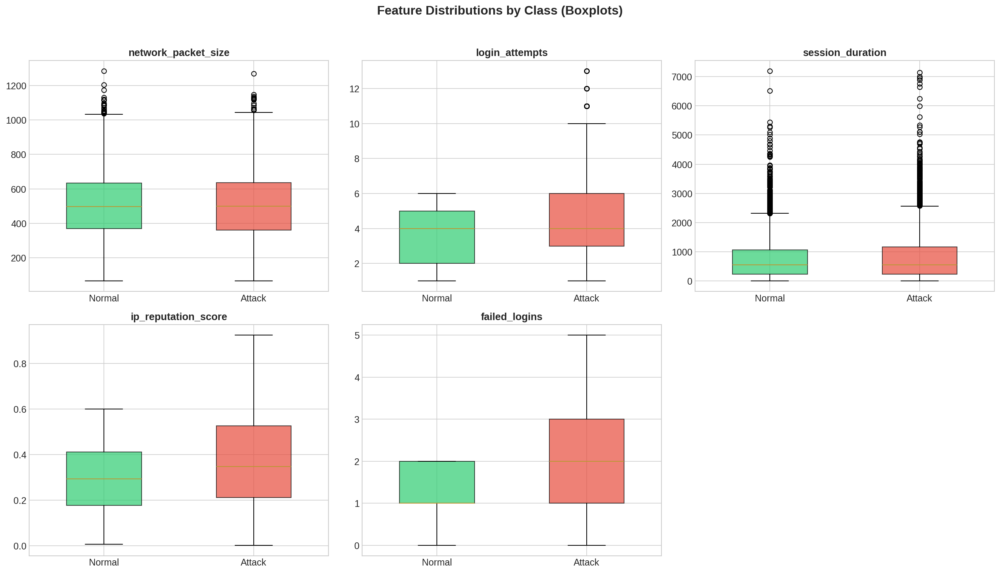

The story these two figures tell is simple and robust. `failed_logins` and `ip_reputation_score` are the only two numerical features where the distributions of the two classes visibly diverge. `network_packet_size` and `session_duration` are essentially overlapping between classes, which motivates the engineered `packet_rate` feature in Section 2.6. We decided early on that any model doing significantly better than a baseline that only used these two features would have to be extracting non-linear interactions.

### Categorical features — the `browser = Unknown` finding — Figure 4

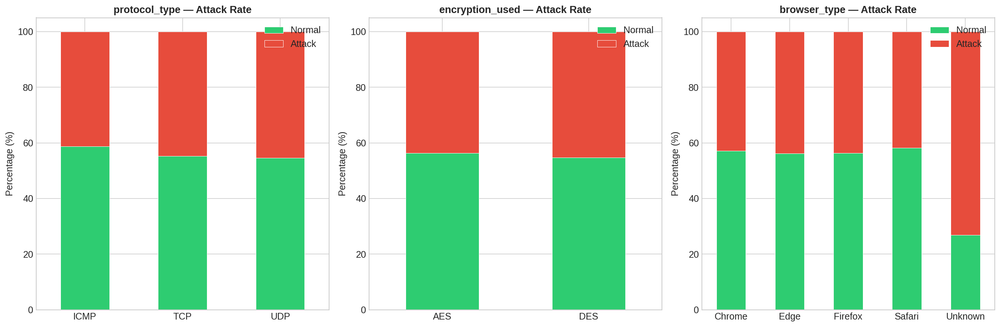

This figure is the single most interesting result of the EDA phase. Protocol and encryption choices carry essentially no signal on their own (41–46% attack rate across modalities). But `browser_type = Unknown` — which in practice covers bots, `curl`, scripts, and anything that doesn't present a recognised User-Agent — has a **73% attack rate**, close to 1.7× the baseline.

We kept Unknown as a separate one-hot category rather than bucketing it with "Other", and in the SHAP analysis we confirmed that `browser_Unknown` is consistently in the top features every tree-based model relies on. We considered this the project's first real insight beyond "tune a classifier".

### Correlation structure — Figures 5 and 6

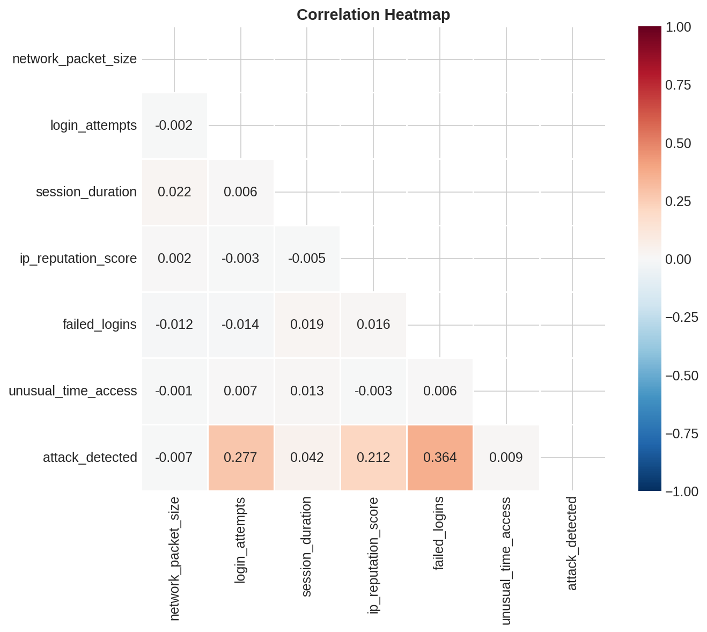

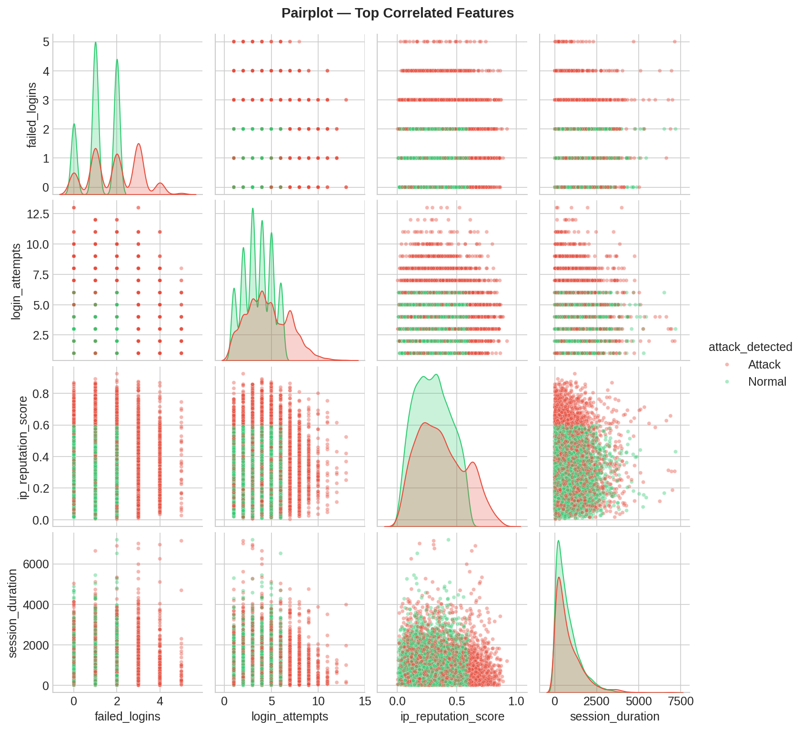

Two things mattered here:

- **No multi-collinearity.** All inter-feature correlations are within ±0.02, so we did not need to drop redundant features or use PCA. We could feed the full set to every model and let each decide what to use.
- **Non-linear decision boundary.** The pairplot shows the two classes inter-mixed in every 2D projection. This is why a Logistic Regression — even with `class_weight="balanced"` — plateaus at F1 = 0.73, while tree ensembles climb to 0.85.

### Feature engineering — Figures 7 and 8

We created four engineered features in `src/utils/feature_engineering.py`:

- `login_fail_ratio = failed_logins / login_attempts` (guarded against division by zero)
- `packet_rate = network_packet_size / session_duration` (guarded)
- `risk_score = 0.4 · ip_reputation_score + 0.3 · unusual_time_access + 0.3 · login_fail_ratio`
- `high_risk_ip = (ip_reputation_score > 0.7)` as an integer flag

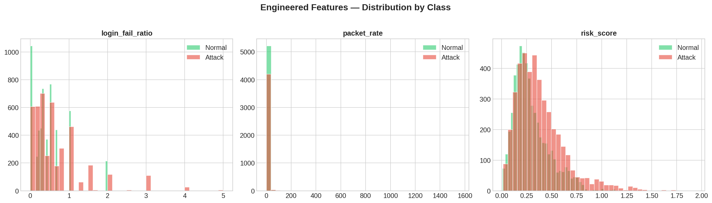

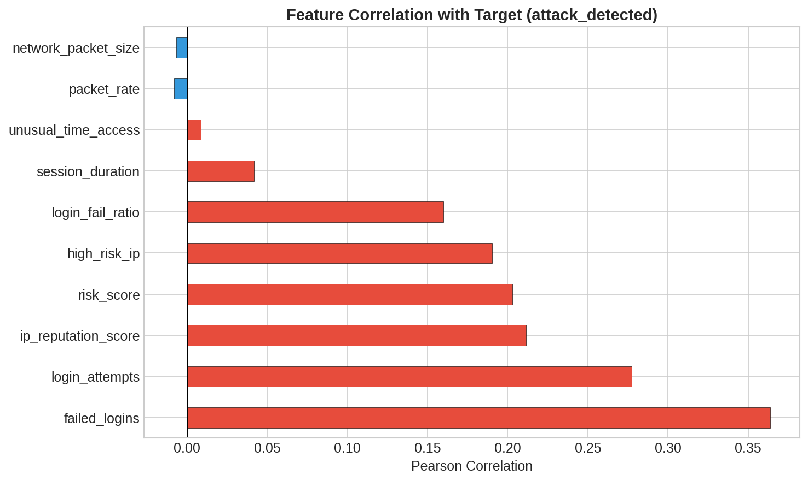

The ranking in Figure 8 is what we actually used to decide what to keep. `risk_score`, `high_risk_ip`, and `login_fail_ratio` — all engineered — rank 4th, 5th, and 6th respectively, beating four of the raw features. `packet_rate` ranked dead last, in line with the fact that the features it combines also have essentially zero correlation with the target. We kept it anyway, because tree-based models can still exploit it through interactions that univariate correlation cannot surface.

### Final preprocessing pipeline

The fitted pipeline, wrapped in a scikit-learn `ColumnTransformer`, is:

- **Numerical** (5 raw + 3 engineered = 8 features): `StandardScaler` (Z-Score)
- **Categorical** (`protocol_type`, `encryption_used`, `browser_type`): `OneHotEncoder(drop="first", handle_unknown="ignore")`, which lets inference-time Unknown values encode as all zeros rather than throw
- **Binary** (`unusual_time_access` and `high_risk_ip`): pass-through

After the transformer, each session is an 18-column vector. We split 80/20 stratified on the target, giving us `X_train.shape = (7629, 18)` and `X_test.shape = (1908, 18)`. The random seed (42) is fixed in `numpy`, `scikit-learn` and `tensorflow` for exact reproducibility.

The entire pipeline is serialised to `saved_models/preprocessor.joblib`, so training and inference use the *same* transformer — we avoid training-serving skew by construction.

---

## Model Training and Comparison

Our strategy was to build up complexity step by step: one baseline per hypothesis, and we only moved to the next model when the previous one had taught us something. All runs were tracked in MLflow under the experiment `cybersecurity-ids`.

### Classical baselines — Figures 9 and 10

We trained four baselines:

- **Dummy Classifier** (`strategy="most_frequent"`) — the floor: predicts Normal every time. F1 = 0.0000, Accuracy = 0.5529. Any model we keep must beat this.
- **Logistic Regression** — tests whether the problem is linearly separable.
- **Random Forest** (`n_estimators=200`, `max_depth=15`, `class_weight="balanced"`) — tests whether tree ensembles capture the non-linear boundary we saw in Section 2.5.
- **XGBoost** (`n_estimators=200`, `max_depth=6`, `learning_rate=0.1`, `scale_pos_weight=1.24`) — tests whether gradient boosting adds anything over bagging.

All four were logged to MLflow with parameters, metrics (accuracy, precision, recall, F1, ROC-AUC, PR-AUC), train time, inference time, and the fitted model artefact.

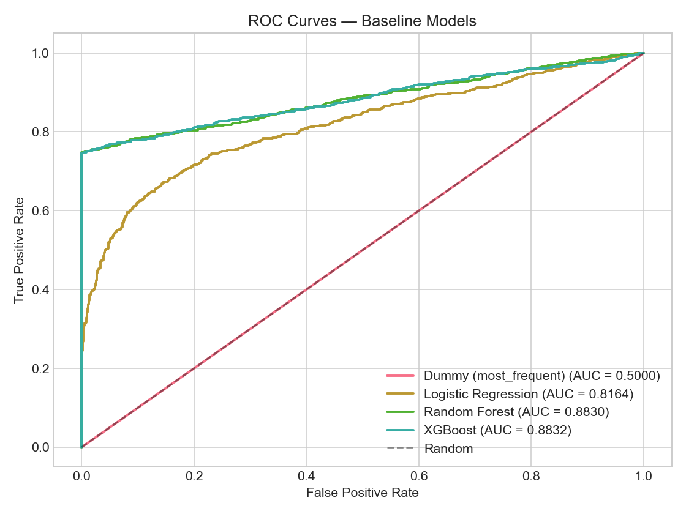

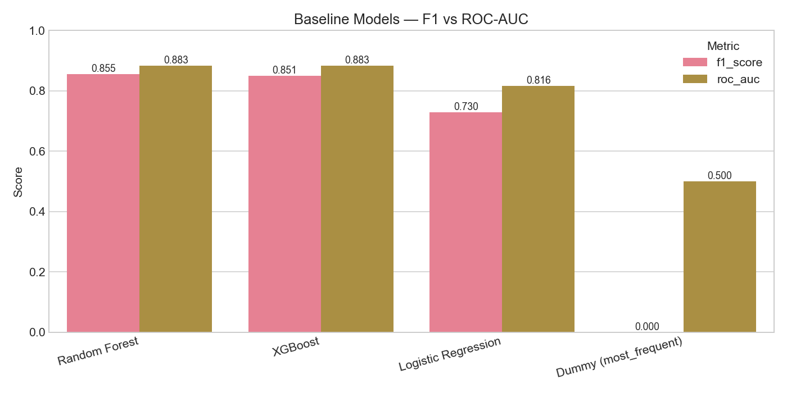

The measured results on the held-out test set (1908 samples):

| Model                   | Accuracy |     F1 | ROC-AUC | Train   | Inference |
|-------------------------|---------:|-------:|--------:|--------:|----------:|
| Dummy (most_frequent)   |   0.5529 | 0.0000 |  0.5000 |  0.00 s |   4.1 ms  |
| Logistic Regression     |   0.7573 | 0.7297 |  0.8164 |  0.02 s |   0.2 ms  |
| **Random Forest**       |   0.8868 | **0.8550** |  0.8830 |  0.41 s |  67.8 ms  |
| XGBoost                 |   0.8826 | 0.8507 |  **0.8832** |  0.25 s |   1.8 ms  |

Three findings came out of this step:

- The Logistic Regression at F1 = 0.73 is a useful signal: three linear features (`failed_logins`, `login_attempts`, `ip_reputation_score`) already carry most of what's there. Our non-linear models had to do the other ~12 points.
- Random Forest and XGBoost are effectively tied. Random Forest edges F1 by 0.004 and XGBoost edges AUC by 0.0002. We picked RF as the baseline champion on the F1 tie-break, but we continued to evaluate both through the rest of the project.
- **Precision on Attack is 1.00 for Random Forest** — zero false positives on the test set. Recall sits at 0.75, meaning we miss about a quarter of the attacks. This recall ceiling, which will recur across every model, is our primary honesty point in the report: it's a property of the feature set, not of the algorithm.

### Deep Learning — Figures 11 and 12

We trained four DNN variants with Keras, all from the same parametric builder in `src/models/deep_learning.py`:

- **Baseline:** `Dense(128) → Dropout(0.3) → Dense(64) → Dropout(0.3) → Dense(32) → Dense(1, sigmoid)`, Adam (lr=1e-3), binary cross-entropy, `batch_size=32`, `validation_split=0.15`.
- **v1:** same architecture, `dropout = 0.5` (stronger regularisation).
- **v2:** same architecture, `batch_size = 128` (faster convergence).
- **v3:** deeper architecture `256 → 128 → 64 → 32`, `dropout = 0.3`, `batch_size = 32`.

Every variant used `EarlyStopping(patience=10, restore_best_weights=True)` and `ReduceLROnPlateau(factor=0.5, patience=5)`. All four were logged to MLflow alongside the baselines so we could compare side by side.

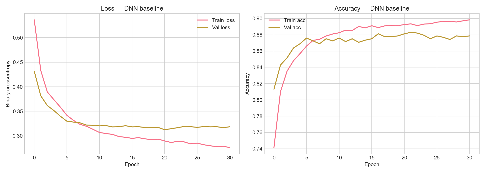

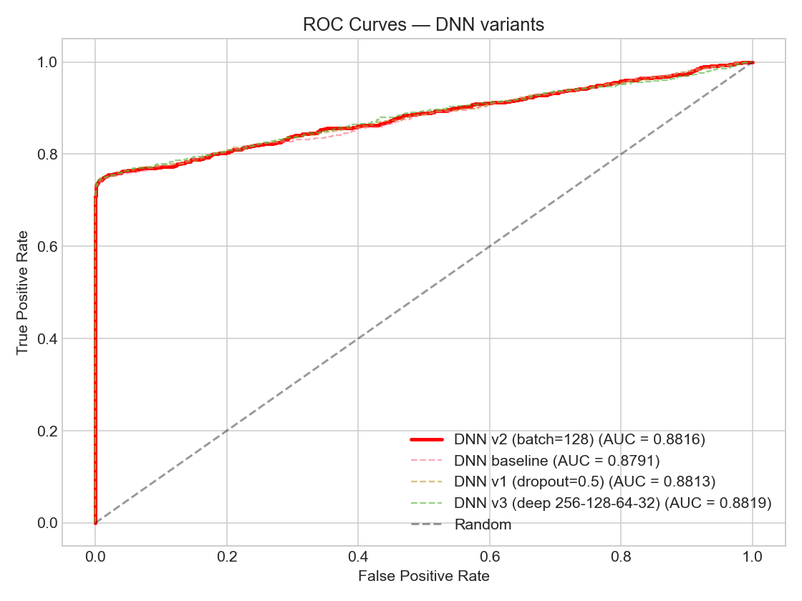

Results on the test set:

| Variant                         | Accuracy |     F1 |    AUC | Epochs | Train  |
|---------------------------------|---------:|-------:|-------:|-------:|-------:|
| DNN baseline (128-64-32, do=0.3) |   0.8800 | 0.8470 | 0.8791 |     31 | 12.3 s |
| DNN v1 (dropout=0.5)            |   0.8810 | 0.8475 | 0.8813 |     30 | 11.2 s |
| **DNN v2 (batch=128)**          |   0.8816 | **0.8493** | 0.8816 |     34 |  **7.0 s** |
| DNN v3 (deep 256-128-64-32)     |   0.8805 | 0.8480 | 0.8819 |     26 | 12.1 s |

The best DNN (**v2**, F1 = 0.8493) sits **below** Random Forest (F1 = 0.8550) and below XGBoost (F1 = 0.8507). The spread between the best and worst DNN variant is 0.23 F1 points — essentially noise. We interpret this as evidence that we hit the ceiling of the feature set, and no DNN architecture we could reasonably try would pass F1 ~ 0.85 on this data. The one DNN-specific takeaway was that **`batch_size = 128` trained 1.7× faster than `batch_size = 32`** for no loss in accuracy; we adopted it as the best DNN variant for everything that followed.

### Ensembles

We tried a soft `VotingClassifier` (LR + RF + XGBoost) and a `StackingClassifier` with a Logistic Regression meta-learner, both trained on the same split with 5-fold CV for the meta-learner.

| Ensemble                 | Accuracy |     F1 |    AUC |
|--------------------------|---------:|-------:|-------:|
| Voting (soft, 3 models)  |   0.8863 | 0.8543 | 0.8762 |
| Stacking (LR meta)       |   0.8857 | 0.8543 | 0.8840 |

Both ensembles gained **0.0007 F1 points at most** over the single Random Forest while tripling the inference time and doubling the artefact size. We concluded that ensembles did not pay their complexity cost on this problem and **did not deploy them**. This decision is documented because ensemble-by-default is a common reflex that we wanted to push back on with data.

### Champion selection

We deployed **Random Forest** as the champion. The justification, which we rehearsed for the demo:

- **Highest F1 on the test set** (0.855) — the primary metric we chose at the start of Section 4.
- **Perfect precision on Attack** (1.00 vs 0.99 for XGBoost) — zero false positives, which matters operationally.
- **Fast and cheap inference** (0.019 ms per sample = 50 000 predictions per second).
- **TreeExplainer is ~100× faster than KernelExplainer** for a DNN — the live SHAP explanation in the UI (Section 6) would not run in real time on a DNN champion.
- **No TensorFlow runtime required in production** — the deployed Docker image is smaller and simpler.

The champion model, preprocessor, default threshold (0.5), and training metadata are bundled into `saved_models/best_model.joblib` by `scripts/export_models.py`, and the FastAPI app loads the bundle once at startup.

---

## Evaluation Metrics

### Metrics chosen

Our primary metric is **F1 score on the Attack class**. Two reasons:

- The dataset is mildly imbalanced (1.24:1), so raw accuracy gives a slight reward to models that lean toward the majority class.
- In an IDS, a false negative (missed attack) is operationally worse than a false positive (extra alert). Recall on Attack is therefore our sentinel.

We also reported accuracy, precision, recall, ROC-AUC, PR-AUC, and inference time per sample in every MLflow run.

### Full comparison table — Figure 20

Across the 10 models we trained (4 baselines + 4 DNN + 2 ensembles):

| Rank |     Model              | Accuracy | F1         | Recall | Precision |    AUC |
|-----:|------------------------|---------:|-----------:|-------:|----------:|-------:|
|    1 | **Random Forest**      |   0.8868 | **0.8550** | 0.7468 |    1.0000 | 0.8830 |
|    2 | Stacking (LR meta)     |   0.8857 | 0.8543     | 0.7491 |    0.9938 | 0.8840 |
|    3 | Voting (soft)          |   0.8863 | 0.8543     | 0.7456 |    1.0000 | 0.8762 |
|    4 | XGBoost                |   0.8826 | 0.8507     | 0.7479 |    0.9861 | 0.8832 |
|    5 | DNN v2 (batch=128)     |   0.8816 | 0.8493     | 0.7468 |    0.9845 | 0.8816 |
|    6 | DNN v1 (dropout=0.5)   |   0.8810 | 0.8475     | 0.7397 |    0.9921 | 0.8813 |
|    7 | DNN v3 (deep 256-128)  |   0.8805 | 0.8480     | 0.7456 |    0.9830 | 0.8819 |
|    8 | DNN baseline           |   0.8800 | 0.8470     | 0.7433 |    0.9845 | 0.8791 |
|    9 | Logistic Regression    |   0.7573 | 0.7297     | 0.7327 |    0.7267 | 0.8164 |
|   10 | Dummy (most_frequent)  |   0.5529 | 0.0000     | 0.0000 |    0.0000 | 0.5000 |

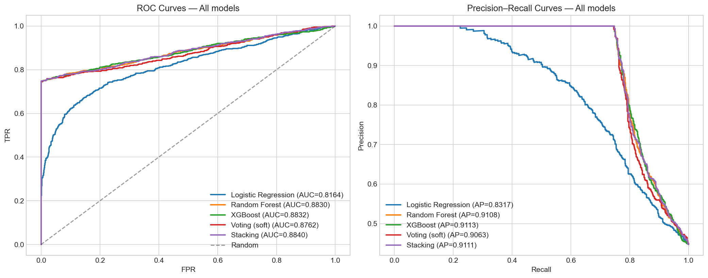

Two structural observations come out of this table:

- **Every non-trivial model lands within 0.01 F1 of the others.** This is our empirical case for a feature-set ceiling: with the 22 processed columns we have, no tuning or architectural change pushes F1 past ~0.855.
- **Recall plateaus at 0.745 across every model.** All eight of our top models miss approximately 25% of the attacks. Our interpretation is that those attacks mimic normal sessions in the feature space we observe, and no classifier can separate them without additional inputs (e.g. packet payloads or host-level signals).

### Threshold analysis — Figure 21

Because the default 0.5 decision threshold is arbitrary, we swept it on the XGBoost probabilities and computed F1 for each value.

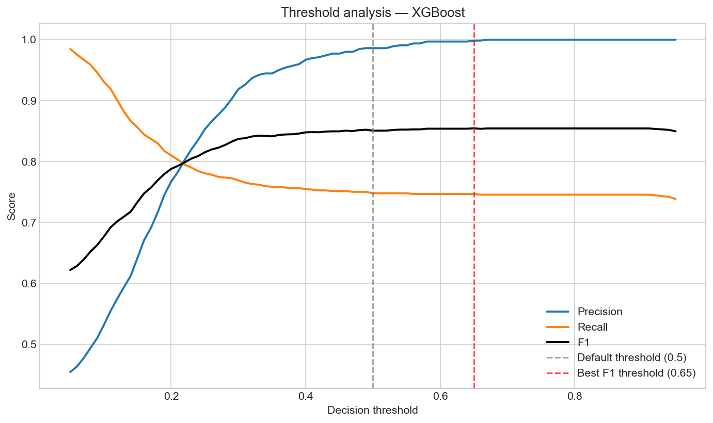

The F1 curve is essentially flat, peaking at t = 0.65 with a 0.0004 gain over the default. We kept 0.5 in production because the gain was not worth the extra parameter to justify, and because the "what threshold do you use?" question is already confusing for newcomers.

---

## Interpretability and Explainability

### Method choice

We used **SHAP TreeExplainer** on our tree-based champions (Random Forest and XGBoost). For the DNN we used **KernelExplainer** on a 100-sample background, but the results were too noisy to be actionable in the time budget, and Tree SHAP was orders of magnitude faster (~1 ms vs ~10 s per prediction). Given that our champion is Random Forest, Tree SHAP also happens to be what powers the live explanation in the deployed UI.

### Global SHAP — Figures 13, 14, 19


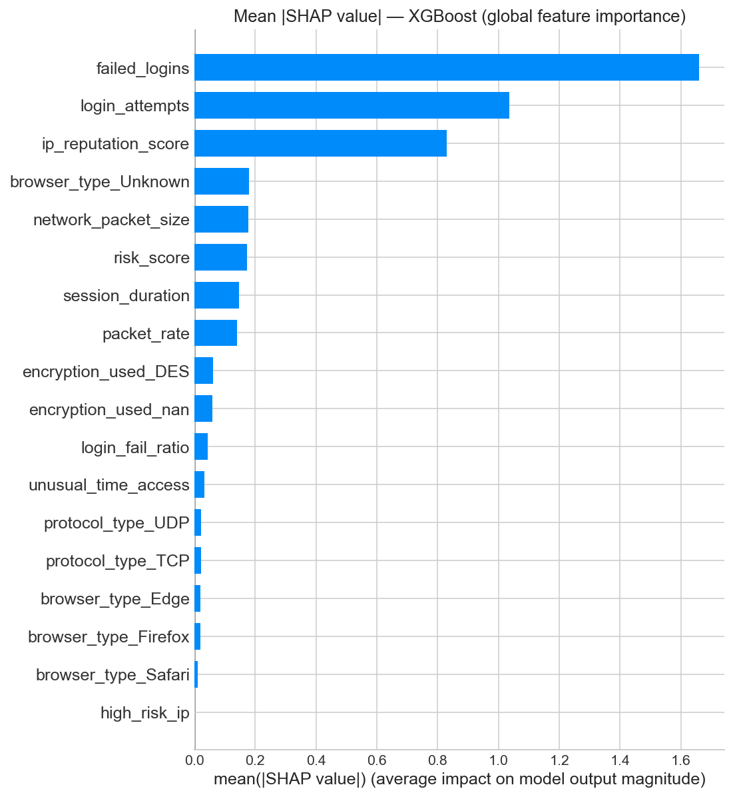

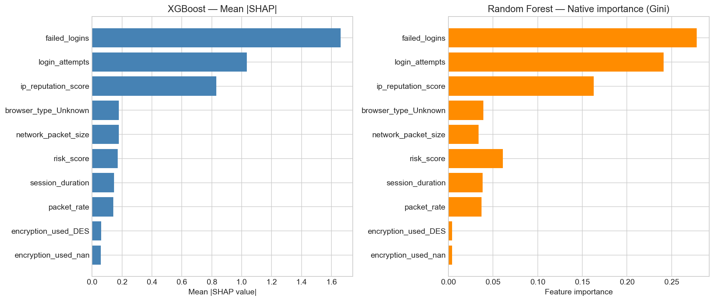

The two tree-based models ranked features almost identically:

1. `failed_logins` (mean|SHAP| = 1.66 on XGBoost; rank 1 on RF Gini)
2. `login_attempts` (1.03; rank 2)
3. `ip_reputation_score` (0.83; rank 3)
4. `browser_type_Unknown` (0.18; rank 6 on RF) — **confirming the EDA finding**
5. `network_packet_size` (0.18; rank 9 on RF) — SHAP surfaced it higher than Gini did, suggesting it participates mostly through interactions

The convergence between SHAP and Gini told us the explanations were robust — we were not just seeing an artefact of one of the importance methods.

### Individual predictions — Figures 15, 16, 17

We picked three representative sessions from the test set — a true positive, a false positive, and a false negative — and generated SHAP waterfall plots for each.

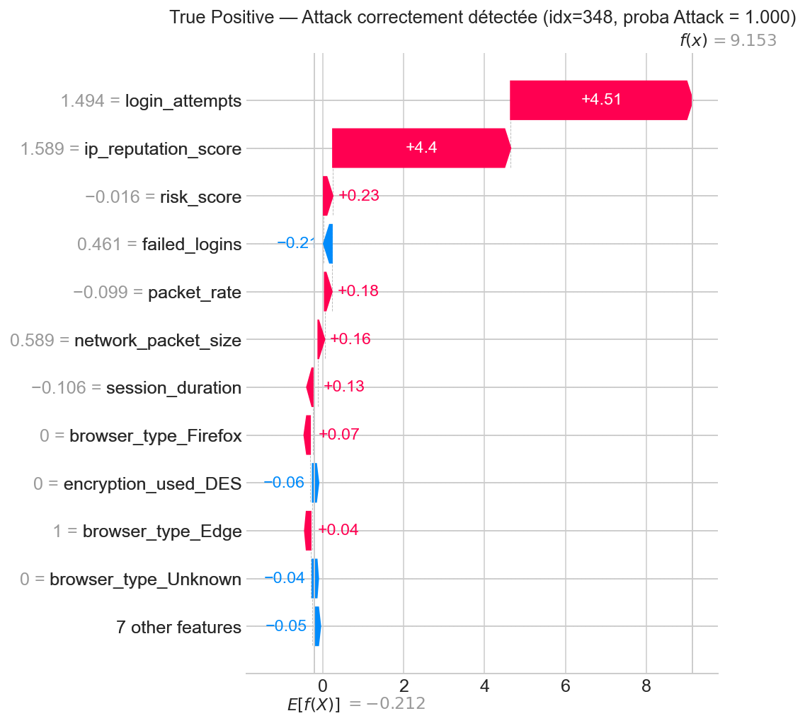

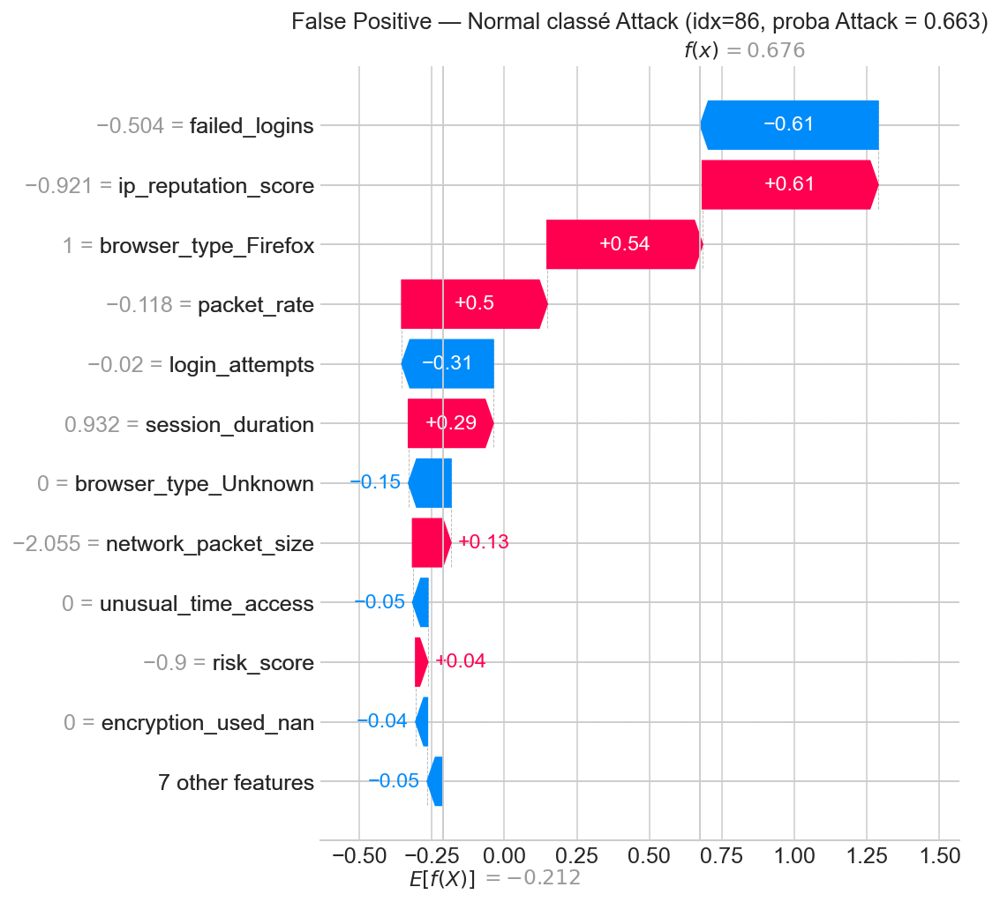

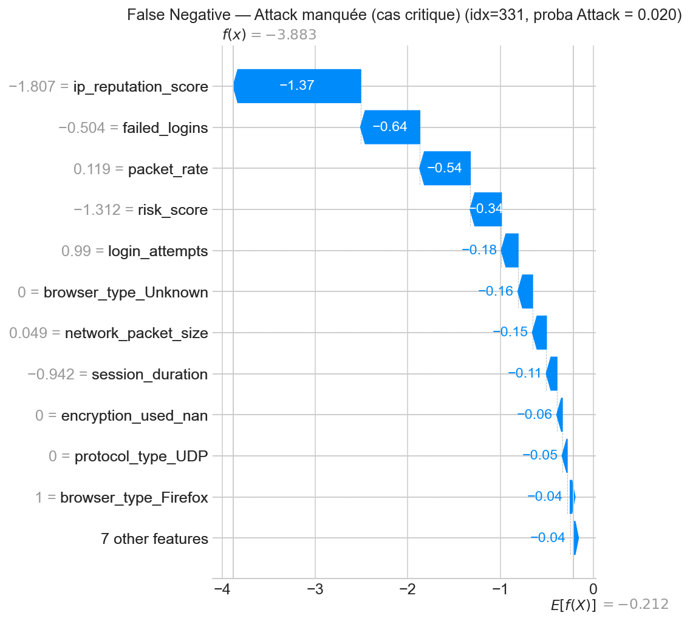

The false-negative case deserves special attention. Its features look entirely typical: Chrome browser, encrypted session, three login attempts, an IP reputation score of 0.45. Every numerical feature sits inside the densest part of the Normal distribution. Our interpretation is that attacks of this kind — an attacker using stolen credentials from a legitimate endpoint — are outside the reach of our data, and no amount of model tuning will surface them. Detecting them would require payload inspection or host-level telemetry.

### Feature dependence — Figure 18

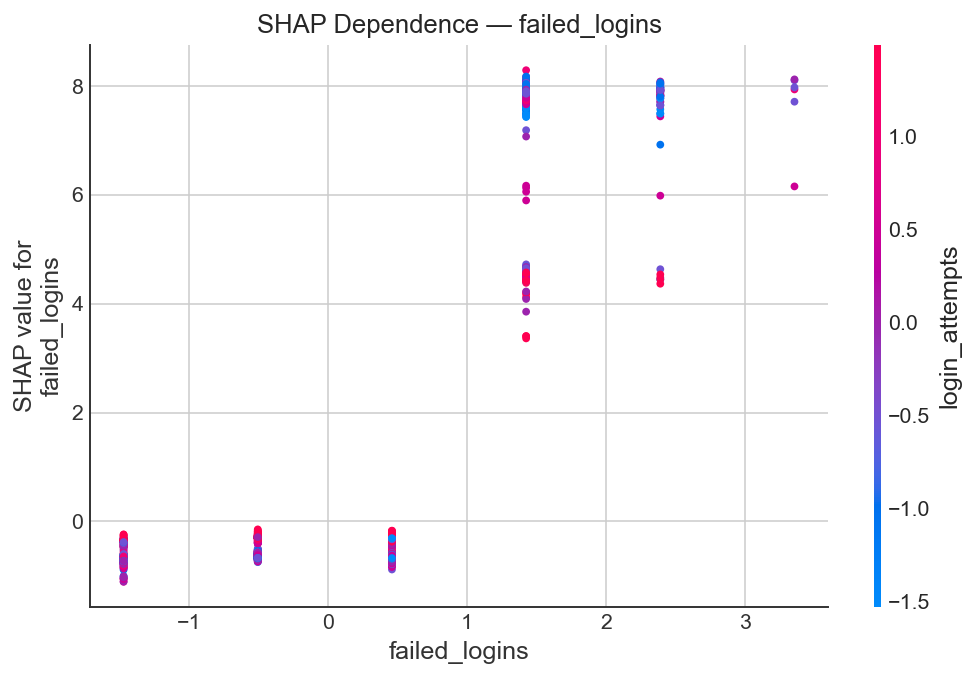

The plot confirms an intuitive interaction: failed logins from a clean IP are less suspicious than failed logins from a reputation-flagged IP. Both features contribute independently, and their combination contributes more than the sum of the parts — exactly the kind of interaction a non-linear model captures and a Logistic Regression cannot.

---

## Deployment and Performance Tracking

### Architecture

We deployed a **single Docker service**, `cybersecurity-ids-api`, running on port 8000. The service hosts:

- `GET /health` — Kubernetes-style readiness probe
- `GET /model/info` — model type, path, default threshold, training metadata
- `POST /predict` — JSON prediction endpoint
- `GET /` → HTTP 307 redirect to `/ui`
- `GET /ui` — the Gradio UI mounted on the same FastAPI app via `gr.mount_gradio_app(app, demo, path="/ui")`

The design choice of one service (instead of one container for the API and one for the UI) keeps the model loaded in memory once, eliminates cross-container HTTP hops for the UI's prediction calls, and halves the surface of things that can fail to start. MLflow is available as an optional second service behind `--profile tools`, so `docker compose up -d` launches only the evaluated service.

### Champion bundle and startup

At container start, the FastAPI `startup` event loads `saved_models/best_model.joblib`, which is a dict containing the champion model, the fitted preprocessor, the champion name, the default decision threshold, and training metadata. A second hook loads the four comparison models (LR, RF, XGBoost, DNN v2) from `saved_models/*.joblib` and `dnn.weights.h5`; if any of those is missing the comparison section of the UI falls back gracefully to whatever was successfully loaded.

The DNN was saved as **weights only** (`dnn.weights.h5`) plus a minimal `dnn_arch.joblib` describing `n_features`. The API reconstructs the architecture at load time and calls `load_weights`. We adopted this pattern after a cross-version failure with the `.keras` format when we tried to load a host-saved model inside the container.

### The Gradio UI — live SHAP and 4-model comparison

The UI has three parts, all on one page, and is the piece we are most proud of:

1. **A 9-feature input form** with sliders, dropdowns, and three one-click presets (Normal traffic, Obvious attack, Edge case).
2. **The champion verdict** in a coloured banner — label, probability, and risk level (LOW/MEDIUM/HIGH/CRITICAL).
3. **A SHAP waterfall** for the champion's prediction, generated on the fly (~100 ms per call thanks to the cached TreeExplainer), showing the top ten contributing features with red bars pushing toward Attack and blue pushing toward Normal.
4. **A "All 4 candidate models on this input" section** displaying four cards side by side. Each card shows the model's probability on this sample, its prediction, its measured inference time, and — below a dashed separator — its **F1 on the full test set** (the best F1 is highlighted in green and bold). A banner below the cards reads CONSENSUS, PARTIAL, or DISAGREEMENT based on the spread across models, and reminds the reader that the champion is chosen on global F1, not on the current sample.

This last piece is the core of our demo story. On `Obvious attack`, all four models cluster around 0.99–1.00; on `Edge case`, Logistic Regression sits at exactly 0.499 (the linear boundary passes through the sample) while the three non-linear models all say Normal at 0.13–0.18. The live visual makes the argument of Section 3 tangible in three seconds.

### `docker compose up -d` and the reproducibility contract

The full deployment contract is:

```bash
cd repo/docker
docker compose up -d
# wait ~7 seconds for the healthcheck to pass
# open http://localhost:8000 in a browser
```

No `pip install`, no model training, no manual file copying. `saved_models/` is committed (three `.joblib`, one `.h5`, one `.joblib` arch descriptor, one metadata file, one champion bundle) so that `docker compose up -d` works from a fresh clone or from the ZIP we submitted, without any preparatory step.

Two Dockerfile decisions are worth noting:

- **Ordered COPY:** `requirements.txt` is copied before `src/`, so the slow pip install layer (~3 minutes for TensorFlow, XGBoost, SHAP, MLflow, Gradio) is cached when only our code changes. This takes rebuild time from ~3 minutes to ~5 seconds for iterative development.
- **Read-only model mount:** the container mounts `saved_models/` as `:ro` because the API never writes model files, and we wanted to close that write vector.

### MLflow tracking

Every training run in notebooks 02, 03 and 05 calls `mlflow.start_run()` inside the `cybersecurity-ids` experiment. We logged:

- **Parameters:** model name, all hyperparameters (stringified to avoid non-JSON-serialisable callables in XGBoost), preprocessing configuration, random seed
- **Metrics:** accuracy, precision, recall, F1, ROC-AUC, PR-AUC, train time, inference time
- **Per-epoch metrics for the DNN:** `loss`, `val_loss`, `accuracy`, `val_accuracy`
- **Artifacts:** confusion matrix PNG, serialised model

This gave us ten runs across the project that we could sort by F1 in the UI and compare side by side. We deliberately kept MLflow out of the `docker compose up -d` default path because (a) the evaluation only touches the one service that serves the model, and (b) the run `meta.yaml` files contain absolute Windows paths for artefacts, which would not resolve inside a Linux container. MLflow is available locally via `mlflow ui` from the `repo/` directory if a reader of this report wants to inspect the runs.

---

## Reflections and Observations

### Challenges faced

- **`sklearn` cross-version drift broke Logistic Regression loading.** The champion bundle was first serialised with `scikit-learn` 1.8.0 on a team member's laptop; the container had 1.7.2. Random Forest unpickled with a warning but ran fine; Logistic Regression raised `AttributeError: 'LogisticRegression' object has no attribute 'multi_class'` because the attribute had been removed in 1.8. We pinned `scikit-learn==1.7.2` in `requirements.txt` and retrained every model in that environment. The incident cost us ~an hour and taught us that "warnings we ignored" in the notebook were hiding a real inference-time failure.

- **`.keras` model format failed to deserialise cross-version.** The DNN, saved with `tf.keras` on the host, refused to load inside the container with an error about an unrecognised `quantization_config` argument on `Dense` layers. The container and host both had TensorFlow 2.21.0, but the Keras internal serialisation format had evolved. We switched to **weights-only** (`dnn.weights.h5`) plus a tiny architecture descriptor, and we now rebuild the model in-place at load time. This is the most portable way we found to ship a Keras model across environments.

- **MLflow `meta.yaml` files carry absolute paths.** When we tried to spin up the MLflow UI inside Docker to show the runs live, we realised every run recorded `artifact_uri: file:C:\Users\...\mlruns\...`, which doesn't exist in a Linux container. The UI would list the runs and metrics but fail on artefact preview. We moved MLflow to an optional profile and recommended running `mlflow ui` directly on the host for inspection.

- **Gradio 6 deprecated `theme=` on the `Blocks` constructor.** A minor warning, harmless in practice but noisy at startup. We left it as-is; moving theme to `launch()` would have forced us to un-mount from FastAPI.

### Key takeaways

- **Measure the ceiling before chasing it.** The moment every non-trivial model landed within 0.01 F1 of the others, we stopped tuning and started investigating *why*. The "why" (recall plateau at 0.745 across the board) is a more valuable finding for the report than a 0.001 F1 improvement from a GridSearchCV sweep would have been.
- **Engineered features earn their place or they don't.** Three of our four engineered features ranked in the top six by correlation with the target. `packet_rate` did not — we kept it anyway because it's cheap to compute and a tree model can still exploit it through interactions. We did not try to force feature ranking into a narrative of "everything we created was useful"; reporting `packet_rate` as neutral is part of the honesty of this report.
- **Trees beat DL on tabular data of this size.** We trained 4 DNN variants with proper regularisation, and none of them matched Random Forest. This is consistent with the recent literature ([Grinsztajn et al. 2022](https://arxiv.org/abs/2207.08815)) and with common experience: DL shines on unstructured data (images, audio, text) where automatic feature extraction is the whole value proposition. On a 22-column tabular problem with engineered features that already do the heavy lifting, a gradient-boosted or bagged ensemble is the right tool.
- **Interpretability belongs in the deployment, not in a slide.** A SHAP waterfall that shows up *inside the prediction UI* makes the explainability argument every time a user clicks Predict. A SHAP summary plot in a report is a one-off that the reader forgets.
- **The cost of a feature is what it adds to the demo story, not what it adds to the F1.** Our 4-model comparison costs us ~300 ms per prediction and two extra model loads at startup. It is not the highest-performing addition we could have made. But it lets us defend our champion choice in the UI without any slide — the demo user sees *live* that every non-trivial model converges to ~0.85 F1 on the full test set, and that the champion is just the best one in a close race. That storytelling is the actual deliverable.

### Limits and future work

- **Recall ceiling of 0.745 is fundamental, not algorithmic.** Lifting it would require new inputs — packet payload features, host telemetry, or temporal context (session sequences). Anything else we could have tried on the existing features would be inside the noise.
- **The Unknown-browser prior can be miscalibrated.** Figure 16 (false positive) shows a Normal session flagged Attack because of a combination of browser=Unknown and elevated failed_logins. A threshold adjustment or a second-stage classifier that explicitly re-evaluates Unknown cases could raise precision further, at a small cost to recall.
- **Continuous retraining.** The MLflow + Docker setup we built is already the infrastructure for a retraining pipeline: a cron job that re-runs `scripts/export_models.py` on fresh data and produces a new bundle; the API picks up the new bundle on restart with no code change. We did not wire the cron job, but everything else is in place.
- **Explainability for the DNN.** We used KernelExplainer and found it too slow to be useful in a UI. DeepExplainer would be a faster alternative to try, at the cost of a TF dependency in production. With Random Forest as the champion, this is a "nice to have", not a blocker.

---

## Conclusion

We set out to build an interpretable, deployable intrusion detection model, and the final deliverable is closer to "defensible" than "best-in-class" — which we argue is the right mode for this problem and this data. The dataset's feature set imposes a performance ceiling around F1 = 0.855 and recall = 0.745, and within that ceiling all four of our non-trivial models converge to the same place. We deployed the one that was fastest and simplest to serve, backed the choice with four candidate models running side by side in the UI, and made every prediction self-explanatory with a live SHAP waterfall. The full project launches with `docker compose up -d` and opens at `http://localhost:8000`.

The most useful thing we leave behind is not the champion F1, but the honest picture of why it sits where it does — and a UI that surfaces that picture in five seconds rather than five pages.

---

*Project files submitted in this ZIP:* `repo/notebooks/01–05` (EDA through final comparison), `repo/src/` (pipeline modules, FastAPI service, Gradio UI), `repo/scripts/export_models.py` (reproducible training), `repo/saved_models/` (pre-fitted artefacts), `repo/docker/` (Dockerfile + docker-compose.yml), `repo/reports/figures/` (21 figures plus confusion matrices), `repo/README.md`, `repo/requirements.txt`.
